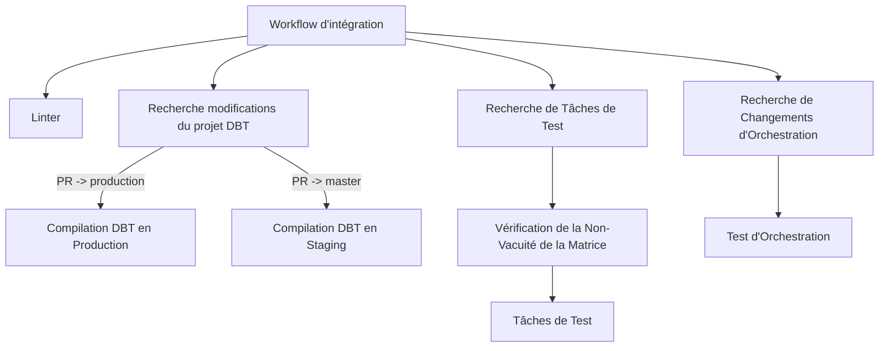
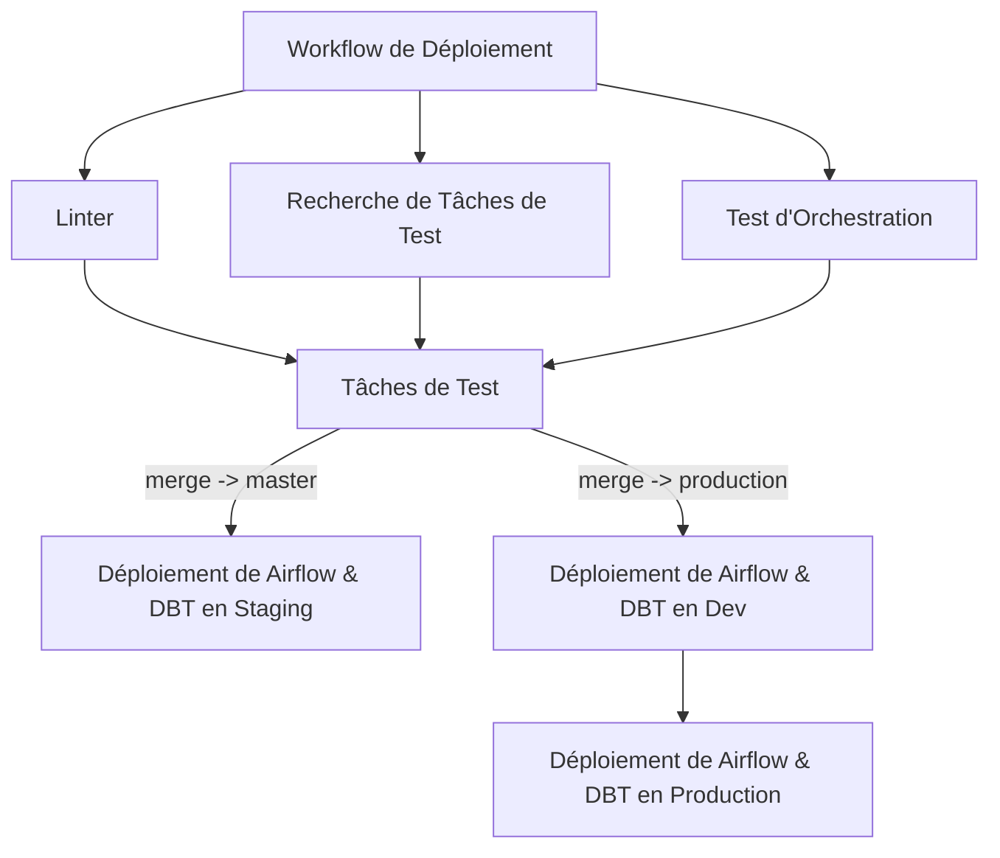

# CI/CD

## Pipeline CI

Vue d'ensemble du workflow d'intégration continue (CI) pour notre projet, détaillant les différents workflows réutilisables et les tâches définies dans notre configuration GitHub Actions.

### Workflow d'intégration

`CI_workflow.yml` est le workflow principal qui est déclenché sur les pull requests.

### Tâches de CI

- **Linter** : La tâche `linter` vérifie le code pour les problèmes de style et de formatting en utilisant `ruff`. Elle se connecte à Google Cloud Secret Manager pour récupérer les secrets nécessaires et envoie éventuellement des notifications à un canal Slack si le linter échoue.
- **Recherche modifications du projet DBT** : Cette tâche recherche s'il y a eu des modifications/création/suppression de fichiers dans le projet DBT.
- **Integration DBT** : Run si le projet dbt a été modifié.

  - Installation et compilation DBT du code poussé en local (worker github).
  - Téléchargement des `remote artefacts` (manifest.json) de la branche cible (master ou prod).
  - Run des modèles modifiés + enfants directs
  - Tests de qualité des modèles associés.

  Ces runs/tests ecrivent les résultats sous forme de view dans un dataset dédié (ci_stg, ci_prod). Le système de `deferal` est utilisé a l'aide du manifest télécharché pour référencer les tables dans la DB (hors ci_stg, ci_prod) et eviter de refaire toute la transformation dans le dataset ci.

- **Recherche de Tâches de Test** : Cette tâche identifie les tâches testables en analysant les fichiers modifiés et en déterminant quelles tâches doivent être testées.
- **Vérification de la Non-Vacuité de la Matrice** : Vérifie que les tâches à tester ont bien des tests ("matrice d'interstection" des nouvelles tâches testables et des tâches ayant des tests est non-vide).
- **Tâches de Test** : Cette tâche exécute des tests sur les tâches identifiées.
- **Recherche de Changements d'Orchestration** : Cette tâche vérifie les changements dans le dossier d'orchestration et détermine si des tests d'orchestration doivent être exécutés.
- **Test d'Orchestration** : Cette tâche exécute des tests d'orchestration si des changements sont détectés.

### Arbre d'Exécution des Tâches (trigger: commit on open PR)

## Pipeline CD

Vue d'ensemble du workflow de déploiement continu (CD) pour notre projet, détaillant les différents workflows réutilisables et les tâches définies dans notre configuration GitHub Actions.

### Workflow de déploiement

Le fichier `CD_workflow.yml` est le workflow principal qui est déclenché sur les pushs vers les branches `master` et `production`. Il inclut plusieurs tâches et utilise des workflows réutilisables pour rationaliser le processus CD.

### DAGs manuels (.rsyncignore)

Pour exclure certains fichiers (par exemple un DAG manuel) du déploiement continu, ajoutez simplement leur chemin relatif dans le fichier .rsyncignore situé à la racine du dossier dags/.

Par exemple, pour exclure un DAG manuel contenu dans dags/jobs/ml/poc/, ajoutez la ligne suivante :

`jobs/ml/poc/`

Tous les fichiers et sous-dossiers correspondant à ce chemin seront exclus du déploiement.

⚠️ Attention : les DAGs exclus ne seront pas déployés dans Airflow. Assurez-vous qu’aucun DAG orchestré ne se trouve dans les dossiers listés dans .rsyncignore.

### Tâches de CD

- **Linter** : La tâche `linter` vérifie le code pour les problèmes de style et de formatting en utilisant `ruff`. Elle se connecte à Google Cloud Secret Manager pour récupérer les secrets nécessaires et envoie éventuellement des notifications à un canal Slack si le linter échoue.
- **Recherche de Tâches de Test** : Cette tâche identifie les tâches testables en analysant les fichiers modifiés et déterminant quelles tâches doivent être testées.
- **Tâches de Test** : Cette tâche exécute des tests sur les tâches identifiées.
- **Test d'Orchestration** : Cette tâche exécute des tests d'orchestration pour s'assurer que les processus sont correctement orchestrés.
- **DBT installation et compilation** : Ces tâches installent python, DBT + dbt-packages, compile le projet dbt et deploie les dbt-packages et le manifest dans le bucket de Airflow.
- **Déploiement de Airflow en Dev** : Cette tâche déploie Airflow dans l'environnement de développement si la branche est `production`.
- **Déploiement de Airflow & DBT en Staging** : Si la branche cible est master, cette tâche déploie Airflow & DBT dans l'environnement de staging (upload les dags, models SQL & artfact DBT dans le bucket staging).
- **Déploiement de Airflow & DBT en Production** : Si la branche cible est `production`, cette tâche déploie Airflow & DBT dans l'environnement de production (upload les dags, models SQL & artfact DBT dans le bucket prod).

### Arbre d'Exécution des Tâches (trigger: merge)

