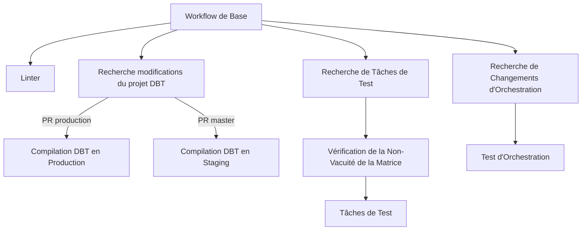
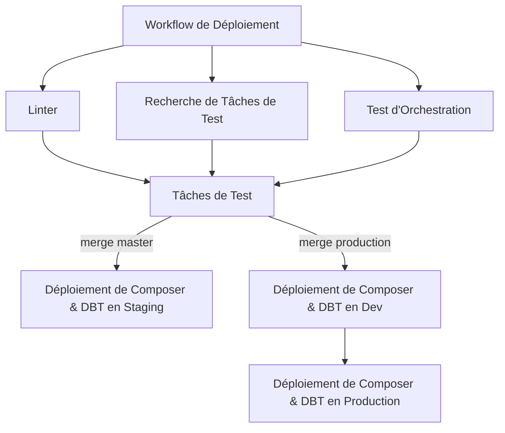

# data-gcp

Repo pour la team data sur GCP.

Ce repo contient les DAGs Airflow et les scripts nécessaires pour l'orchestration des jobs.

- Les DAGs sont dans `orchestration/dags/`
- Les scripts appelés dans les DAGs sont à mettre dans `jobs/`, et divisés en 2 catégories :
  - ETL jobs : pour l'extraction, la transformation et le chargement des données
  - ML jobs : pour les micro services de machine learning

## Organisation

```
+-- orchestration : DAGS Airflow (Cloud Composer)
| +-- airflow
| +-- dags
| +-- tests
|
+-- jobs
| +-- etl_jobs
|   +-- external 
|     +-- adage
|     +-- addresses
|     +-- appsflyer
|     +-- contentful
|     +-- dms
|     +-- downloads
|     +-- metabase-archiving
|     +-- qualtrics
|     +-- sendinblue
|     +-- siren
|     +-- batch
|     +-- ...
|
|   +-- internal
|     +-- cold-data
|     +-- human_ids
|     +-- import_api_referentials
|     +-- ...
|
| +-- ml_jobs
|   +-- algo_training
|   +-- embeddings
|   +-- record_linkage
|   +-- ranking_endpoint
|   +-- clusterisation
|   +-- retrieval_endpoint
|   +-- ...

```

## INSTALL

### Analytics (BigQuery)

#### 0. Prérequis

- [pyenv](https://github.com/pyenv/pyenv-installer)
  - ⚠ Don't forget to [install the prerequisites](https://github.com/pyenv/pyenv/wiki/Common-build-problems#prerequisites)
- [pyenv virtualenv](https://github.com/pyenv/pyenv-virtualenv#installation)
- Accès aux comptes de services GCP
- [Gcloud CLI](https://cloud.google.com/sdk/docs/install?hl=fr)

#### 1. Installation du projet

- Cloner le projet

  ```bash
  git clone git@github.com:pass-culture/data-gcp.git
  cd data-gcp
  ```

- [LINUX] Installation de quelques librairies nécessaires à l'install du projet

  ```bash
  make install_ubuntu_libs
  ```

- [VM DEBIAN] Installation d'autres librairies et fix de l'environnement pour les VM :

  ```bash
  make install_on_debian_vm
  ```

- Installation du projet
  - La première fois : installation from scratch, avec création des environnements virtuels

    ```bash
    make clean_install
    ```

  - Installation rapide des nouveaux packages

    ```bash
    make install
    ```

#### 2. Config .env.local

Dans le fichier `.env.local`, renseigne les valeurs des variables manquantes en utilisant [cette page](https://www.notion.so/passcultureapp/Les-secrets-du-repo-data-gcp-085759e27a664a95a65a6886831bde54)

## Orchestration

Orchestration des jobs dags analytics & data science.

[plus de détails dans dags/README.md](/orchestration/README.md)

Les dags sont déployés automatiquement lors d'un merge sur master / production

## CI/CD


### Workflow CI

Vue d'ensemble du workflow d'intégration continue (CI) pour notre projet, détaillant les différents workflows réutilisables et les tâches définies dans notre configuration GitHub Actions.

#### Workflow de base

`base_workflow.yml` est le workflow principal qui est déclenché sur les pull requests.

#### Tâches

* Linter

La tâche `linter` vérifie le code pour les problèmes de style en utilisant `black`. Elle se connecte à Google Cloud Secret Manager pour récupérer les secrets nécessaires et envoie éventuellement des notifications à un canal Slack si le linter échoue.

* Recherche modifications du projet DBT

Cette tâche recherche s'il y a eu des modifications/création/suppression de fichiers dans le projet DBT.

* Compilation DBT

Il y a deux tâches de compilation, une pour la production et une pour staging, qui compilent le projet DBT en fonction de la branche ciblée lorsque des modifications ont eu lieu dans le projet DBT.

* Recherche de Tâches de Test

Cette tâche identifie les tâches testables en analysant les fichiers modifiés et en déterminant quelles tâches doivent être testées.

* Vérification de la Non-Vacuité de la Matrice

Vérifie que les tâches à tester ont bien des tests ("matrice d'interstection" des nouvelles tâches testables et des tâches ayant des tests est non-vide).

* Tâches de Test

Cette tâche exécute des tests sur les tâches identifiées.

* Recherche de Changements d'Orchestration

Cette tâche vérifie les changements dans le dossier d'orchestration et détermine si des tests d'orchestration doivent être exécutés.

* Test d'Orchestration

Cette tâche exécute des tests d'orchestration si des changements sont détectés.

#### Arbre d'Exécution des Tâches



### Workflow CD

Vue d'ensemble du workflow de déploiement continu (CD) pour notre projet, détaillant les différents workflows réutilisables et les tâches définies dans notre configuration GitHub Actions.

#### Workflow de Base

Le fichier `deploy_composer.yml` est le workflow principal qui est déclenché sur les pushs vers les branches `master` et `production`. Il inclut plusieurs tâches et utilise des workflows réutilisables pour rationaliser le processus CD.

#### Tâches

* Linter

La tâche `linter` vérifie le code pour les problèmes de style en utilisant `black`. Elle se connecte à Google Cloud Secret Manager pour récupérer les secrets nécessaires et envoie éventuellement des notifications à un canal Slack si le linter échoue.

* Recherche de Tâches de Test

Cette tâche identifie les tâches testables en analysant les fichiers modifiés et déterminant quelles tâches doivent être testées.

* Tâches de Test

Cette tâche exécute des tests sur les tâches identifiées.

* Test d'Orchestration

Cette tâche exécute des tests d'orchestration pour s'assurer que les processus sont correctement orchestrés.

* DBT installation et compilation

Ces tâches installent python, DBT + dbt-packages, compile le projet dbt et deploie les dbt-packages et le manifest dans le bucket de Composer.

* Déploiement de Composer en Dev

Cette tâche déploie Composer dans l'environnement de développement si la branche est `production`.

* Déploiement de Composer en Staging

Cette tâche déploie Composer dans l'environnement de staging si la branche est `master`.

* Déploiement de Composer en Production

Cette tâche déploie Composer dans l'environnement de production si la branche est `production`.

#### Arbre d'Exécution des Tâches




## Automatisations

### ML Jobs

Pour créer un nouveau micro service de ML :

```bash
MS_NAME=mon_micro_service make create_microservice
```

où mon_micro_service est le nom du micro service. Exemple :

```bash
MS_NAME=algo_llm make create_microservice
```

Cela va :

1. créer un dossier `algo_llm` dans `jobs/ml_jobs` avec les fichiers nécessaires pour le micro service.
2. rajouter le micro service dans la target install du Makefile
3. Commiter les changements
4. Lancer l'installation du nouveau micro service
