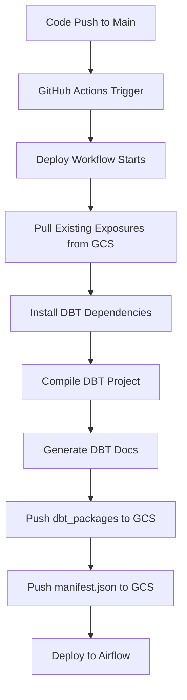
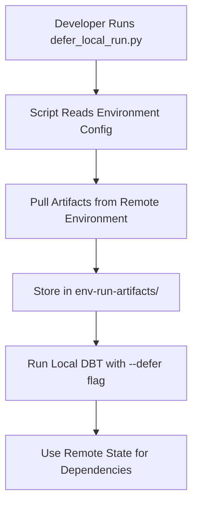
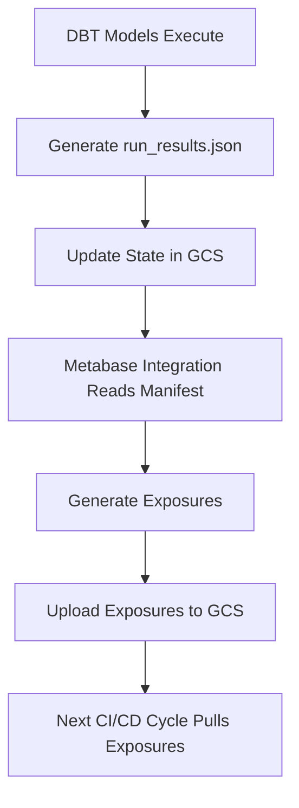
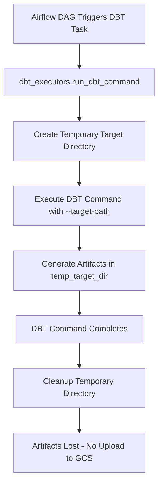

# Analysis: "data" Subfolder Usage in airflow-data-bucket-prod

## Executive Summary

The `data/` subfolder in the `airflow-data-bucket-{env}` Google Cloud Storage bucket serves as a **central artifact repository for DBT operations and CI/CD processes**. This analysis reveals that it's primarily used for managing DBT compilation artifacts, package dependencies, and metadata exposures across development, staging, and production environments.

**Key Findings:**
- The subfolder is exclusively used for DBT-related artifacts, not general data storage
- Write operations are primarily driven by GitHub CI/CD workflows during deployment
- Read operations support both automated processes (CI/CD, Airflow) and local development workflows
- The structure follows a consistent pattern across all environments (dev/stg/prod)

## Bucket Configuration Analysis

### Environment Setup

The bucket configuration is defined in `/orchestration/dags/common/config.py`:

```python
# Line 25-27
GCS_AIRFLOW_BUCKET = os.environ.get(
    "GCS_BUCKET", f"airflow-data-bucket-{ENV_SHORT_NAME}"
)
```

**Environment-Specific Buckets:**
- **Development**: `airflow-data-bucket-dev`
- **Staging**: `airflow-data-bucket-stg`
- **Production**: `airflow-data-bucket-prod`

### Environment Variables

From `/orchestration/dags/data_gcp_dbt/.env.dbt`:
```bash
AIRFLOW_BUCKET_DEV="airflow-data-bucket-dev"
AIRFLOW_BUCKET_STG="airflow-data-bucket-stg"
AIRFLOW_BUCKET_PROD="airflow-data-bucket-prod"
```

## Write Operations Analysis

### 1. GitHub CI/CD Workflows (Primary Writers)

#### A. Deployment Workflow (`reusable_deploy_airflow.yml`)

**DBT Package Dependencies** - Lines 106-110:
```yaml
- name: "Push dependencies (dbt) to GCS (data/target/dbt_packages)"
  working-directory: "./orchestration/dags/data_gcp_dbt/"
  env:
    AIRFLOW_DAGS_BUCKET: ${{ inputs.AIRFLOW_DAGS_BUCKET }}
  run: gsutil -m rsync -d -r target/dbt_packages gs://${{ inputs.AIRFLOW_DAGS_BUCKET }}/data/target/dbt_packages
```

**DBT Manifest** - Lines 112-116:
```yaml
- name: "Push manifest (dbt) to GCS (data/target)"
  working-directory: "./orchestration/dags/data_gcp_dbt/"
  env:
    AIRFLOW_DAGS_BUCKET: ${{ inputs.AIRFLOW_DAGS_BUCKET }}
  run: gsutil cp target/manifest.json gs://$AIRFLOW_DAGS_BUCKET/data/target/manifest.json
```

**DBT Exposures** - Line 86:
```yaml
run: gsutil cp 'gs://${{ inputs.AIRFLOW_DAGS_BUCKET }}/data/exposures/*' ./models/
```

#### B. When Write Operations Occur:
- **Deployment triggers**: When code is merged to main branch
- **Manual deployments**: Via GitHub Actions workflow dispatch
- **Environment-specific**: Each environment gets its own artifact set

### 2. Application-Level Writes

#### Metabase-DBT Integration (`jobs/etl_jobs/external/metabase-dbt/main.py`)

**Exposure Upload** - Lines 70-74:
```python
handler.push_exposures_to_bucket(
    airflow_bucket_name=airflow_bucket_name,
    airflow_bucket_path=f"{airflow_bucket_base_folder}exposures.yml",
    exposure_local_path="exposures.yml",
)
```

**Default Paths** - Lines 49-54:
```python
airflow_bucket_manifest_path: str = typer.Option(
    "data/target/manifest.json",
    help="Path to the manifest file in the Airflow Bucket",
),
airflow_bucket_base_folder: str = typer.Option(
    "data/exposures/",
    help="Base folder in the Airflow Bucket to save the exposures",
),
```

## Read Operations Analysis

### 1. GitHub CI/CD Workflows (Primary Readers)

#### DBT Testing Workflow (`reusable_dbt_workflow.yml`)

**Artifact Retrieval** - Lines 81-82:
```bash
gsutil cp gs://$TARGET_AIRFLOW_BUCKET/data/target/manifest.json env-run-artifacts/manifest.json
gsutil cp gs://$TARGET_AIRFLOW_BUCKET/data/target/run_results.json env-run-artifacts/run_results.json
```

**Purpose**: Enable state-based DBT operations for efficient testing and deployment

### 2. Local Development Support

#### Defer Local Run Script (`orchestration/dags/data_gcp_dbt/scripts/defer_local_run.py`)

**Artifact Pulling Function** - Lines 44-53:
```python
def pull_artifacts(from_env: str):
    bucket = set_bucket_name(from_env)
    if not bucket:
        typer.echo(f"Unknown environment: {from_env}")
        raise typer.Exit(code=1)

    artifacts_path = f"gs://{bucket}/data/target"
    local_dir = f"env-run-artifacts/{from_env}"
    os.makedirs(local_dir, exist_ok=True)

    for file in ["manifest.json", "run_results.json"]:
        subprocess.run(
            ["gsutil", "cp", f"{artifacts_path}/{file}", f"{local_dir}/{file}"],
            check=True,
        )
```

**Environment Configuration** - Lines 76-81:
```python
def set_bucket_name(defer_to: str):
    ENV_BUCKETS = {
        "dev": os.getenv("AIRFLOW_BUCKET_DEV"),
        "stg": os.getenv("AIRFLOW_BUCKET_STG"),
        "prod": os.getenv("AIRFLOW_BUCKET_PROD"),
    }
    return ENV_BUCKETS.get(defer_to, None)
```

### 3. Application-Level Reads

#### Metabase Integration
- **Manifest Reading**: For model metadata and schema information
- **Exposure Management**: Reading existing exposures for updates

## Data Structure and Contents

### Directory Structure
```
gs://airflow-data-bucket-{env}/
└── data/
    ├── target/
    │   ├── manifest.json          # DBT compilation manifest
    │   ├── run_results.json       # DBT execution results
    │   └── dbt_packages/          # DBT package dependencies
    │       ├── package1/
    │       ├── package2/
    │       └── ...
    └── exposures/
        ├── exposures.yml          # Metabase exposure definitions
        └── *.yml                  # Additional exposure files
```

### File Descriptions

#### 1. `data/target/manifest.json`
- **Purpose**: DBT project compilation metadata
- **Contains**: Model definitions, dependencies, configurations, tests
- **Generated by**: `dbt compile` and `dbt docs generate` commands
- **Usage**: State-based DBT operations, documentation generation

#### 2. `data/target/run_results.json`
- **Purpose**: Results of DBT model executions
- **Contains**: Execution status, timing, row counts, errors
- **Generated by**: `dbt run`, `dbt test` commands
- **Usage**: Determining model state for incremental processing

#### 3. `data/target/dbt_packages/`
- **Purpose**: Resolved DBT package dependencies
- **Contains**: Downloaded and resolved package files
- **Generated by**: `dbt deps` command
- **Usage**: Ensuring consistent package versions across environments

#### 4. `data/exposures/exposures.yml`
- **Purpose**: Metabase dashboard and question definitions
- **Contains**: Exposure metadata for lineage tracking
- **Generated by**: Metabase-DBT integration job
- **Usage**: Data lineage and impact analysis

## Process Flow Analysis

### 1. CI/CD Artifact Lifecycle



### 2. Local Development Workflow



### 3. Production Data Flow



## Security and Access Patterns

### Service Account Usage

#### GitHub Actions Authentication
- **Workload Identity Provider**: `passculture-metier-ehp/infra-prod-gcp-workload-identity-provider`
- **Service Account**: `passculture-main-artifact-registry-service-account`

#### Permission Requirements
- **Read Access**: Required for pulling artifacts during CI/CD and local development
- **Write Access**: Required for pushing compiled artifacts and exposures
- **List Access**: Required for rsync operations and directory listing

### Access Patterns
- **Automated**: CI/CD workflows have full read/write access
- **Human**: Developers access via service account credentials for local development
- **Application**: Airflow and job processes read artifacts as needed

## DBT Command Analysis and Artifact Generation

### DBT Commands and Artifact Generation Patterns

Based on DBT documentation and the `dbt_executors.py` implementation, here are the specific DBT commands that generate artifacts eventually stored in the `/data` folder:

#### 1. Commands That Generate `manifest.json`
**Generated by**: Any command that parses the DBT project
```python
# From dbt_executors.py - these functions all trigger manifest generation:
- compile_dbt()                    # Line 165
- compile_dbt_with_selector()      # Line 177
- run_dbt_model()                  # Line 203
- run_dbt_test()                   # Line 235
- run_dbt_snapshot()               # Line 272
- run_dbt_operation()              # Line 287
```

**Core Commands:**
- `dbt compile` - Generates SQL from models without executing
- `dbt run` - Executes models and generates manifest
- `dbt test` - Runs tests and updates manifest
- `dbt build` - Combined run/test/seed/snapshot with single manifest
- `dbt snapshot` - Executes snapshots and updates manifest
- `dbt docs generate` - Generates documentation and manifest

#### 2. Commands That Generate `run_results.json`
**Generated by**: Commands that execute operations against the data warehouse
```python
# From dbt_executors.py - commands that create run results:
- run_dbt_model()          # Creates execution results
- run_dbt_test()           # Creates test results
- run_dbt_snapshot()       # Creates snapshot results
- run_dbt_with_selector()  # Creates selective run results
- run_dbt_quality_tests()  # Creates test execution results
```

**Core Commands:**
- `dbt run` - Model execution results with timing and row counts
- `dbt test` - Test execution results with pass/fail status
- `dbt build` - Combined execution results in single file
- `dbt snapshot` - Snapshot execution results
- `dbt seed` - Seed loading results
- `dbt run-operation` - Macro execution results

#### 3. Commands That Generate `dbt_packages/`
**Generated by**: Package dependency resolution
```bash
dbt deps  # Downloads and resolves package dependencies to dbt_packages/ folder
```

### DBT Executor Implementation Analysis

#### Core Execution Function (`dbt_executors.py:84-152`)

```python
def run_dbt_command(command: list, use_tmp_artifacts: bool = True, **context) -> None:
    """Execute a dbt command using dbtRunner."""
    # Create temporary target directory (Line 92-95)
    if use_tmp_artifacts:
        temp_target_dir = create_tmp_folder(PATH_TO_DBT_TARGET)
    else:
        temp_target_dir = PATH_TO_DBT_TARGET

    # Configure dbt execution (Lines 106-110)
    cli_args.extend(["--target-path", temp_target_dir])      # Artifact output location
    cli_args.extend(["--project-dir", PATH_TO_DBT_PROJECT])  # DBT project location
    cli_args.extend(["--profiles-dir", PATH_TO_DBT_PROJECT]) # DBT profiles location
```

**Key Insights:**
- **Temporary Artifacts**: By default, uses temporary directories to avoid conflicts (Line 92)
- **Target Path Control**: Explicitly sets where artifacts are generated (Line 107)
- **Cleanup Process**: Automatically cleans up temporary artifacts (Lines 149-151)

#### Artifact Lifecycle in Airflow Context



**Important Discovery**: The `dbt_executors.py` implementation uses temporary directories by default and **cleans them up**, meaning most Airflow-executed DBT commands do **NOT** directly contribute artifacts to the GCS `/data` folder.

### Artifact Generation vs. GCS Upload Separation

#### Local Artifact Generation (During DBT Execution)
```python
# These commands generate artifacts locally in target/ or temp directories:
dbt compile  # → manifest.json
dbt run      # → manifest.json + run_results.json
dbt test     # → manifest.json + run_results.json
dbt build    # → manifest.json + run_results.json (consolidated)
dbt docs generate  # → manifest.json + catalog.json + static files
```

#### GCS Upload (During CI/CD)
```yaml
# Only CI/CD workflows upload artifacts to GCS /data folder:
- name: "compile dbt & generate dbt docs"
  run: dbt docs generate --static --target $ENV_SHORT_NAME
- name: "Push manifest (dbt) to GCS (data/target)"
  run: gsutil cp target/manifest.json gs://$AIRFLOW_DAGS_BUCKET/data/target/manifest.json
```

### Command Behavior Analysis

#### 1. State-Based Operations (Reading from GCS)
```bash
# Uses artifacts from bucket for state comparison
dbt run --defer --state env-run-artifacts/prod --favor-state
```

**Implementation in `defer_local_run.py`:**
```python
# Lines 44-53: Downloads artifacts from GCS for local state-based operations
artifacts_path = f"gs://{bucket}/data/target"
for file in ["manifest.json", "run_results.json"]:
    subprocess.run(
        ["gsutil", "cp", f"{artifacts_path}/{file}", f"{local_dir}/{file}"],
        check=True,
    )
```

#### 2. Compilation with Remote State
```bash
# Pulls manifest from bucket, compiles locally with remote dependencies
dbt compile --defer --state gs://airflow-data-bucket-prod/data/target
```

#### 3. Artifact Preservation During Parallel Execution
**Problem**: `run_results.json` gets overwritten by subsequent commands
**Solution**: Copy artifacts before running additional commands
```bash
dbt build
cp target/run_results.json target/run_results_backup.json
dbt docs generate
cp target/run_results_backup.json target/run_results.json
```

### Production Workflow: Artifact Generation and Upload

#### Phase 1: Local Generation (CI/CD Environment)
```yaml
- name: "compile dbt & generate dbt docs"
  run: |
    dbt deps                    # Generates dbt_packages/
    dbt docs generate --static  # Generates manifest.json + catalog.json + docs
```

#### Phase 2: GCS Upload (CI/CD Environment)
```yaml
- name: "Push dependencies (dbt) to GCS"
  run: gsutil -m rsync -d -r target/dbt_packages gs://$BUCKET/data/target/dbt_packages
- name: "Push manifest (dbt) to GCS"
  run: gsutil cp target/manifest.json gs://$BUCKET/data/target/manifest.json
```

#### Phase 3: State-Based Usage (Development/Testing)
```python
# defer_local_run.py pulls artifacts for local development:
pull_artifacts("prod")  # Downloads from gs://airflow-data-bucket-prod/data/target
dbt run --defer --state env-run-artifacts/prod  # Uses downloaded state
```

### Summary: DBT Command Impact on `/data` Folder

**Direct Writers**: None - DBT commands write locally, CI/CD uploads to GCS
**Indirect Writers**: All parsing/execution commands generate artifacts that CI/CD later uploads
**Readers**: `--state` and `--defer` flags read from downloaded GCS artifacts
**Key Pattern**: Local generation → CI/CD upload → Remote state usage

## Recommendations

### 1. Current State Assessment
✅ **Well-Structured**: Clear separation of concerns with dedicated paths
✅ **Environment Isolation**: Proper environment-specific bucket usage
✅ **Automated Workflows**: Robust CI/CD integration
✅ **Developer Support**: Good local development tools

### 2. Potential Improvements

#### A. Monitoring and Observability
- **Recommendation**: Add monitoring for artifact freshness and size
- **Implementation**: Cloud Functions to track artifact update frequency
- **Benefit**: Early detection of broken CI/CD pipelines

#### B. Cleanup Policies
- **Recommendation**: Implement lifecycle policies for old artifacts
- **Implementation**: GCS lifecycle rules to archive old run_results.json
- **Benefit**: Cost optimization and storage management

#### C. Backup Strategy
- **Recommendation**: Cross-region backup for critical artifacts
- **Implementation**: Scheduled gsutil rsync to backup bucket
- **Benefit**: Disaster recovery for production deployments

#### D. Access Auditing
- **Recommendation**: Enable audit logging for bucket access
- **Implementation**: Cloud Audit Logs for GCS access patterns
- **Benefit**: Security compliance and access pattern analysis

### 3. Documentation Improvements
- Add README.md in each environment bucket explaining structure
- Create runbook for manual artifact recovery procedures
- Document access patterns for new team members

## Conclusion

The `data/` subfolder in `airflow-data-bucket-{env}` is a critical component of the DBT workflow ecosystem, serving as the authoritative source for compilation artifacts and deployment state. The current implementation demonstrates good practices in environment separation, automated workflows, and developer tooling support.

The analysis reveals a mature and well-designed system that effectively supports both automated CI/CD processes and local development workflows, with clear patterns for reading and writing DBT artifacts across different environments.
