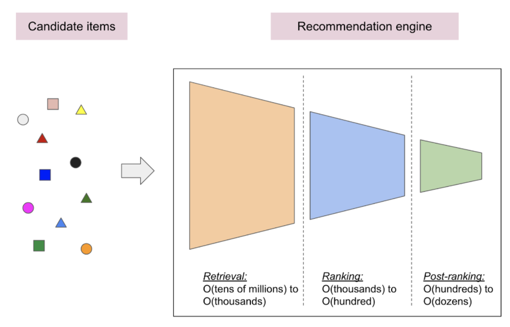
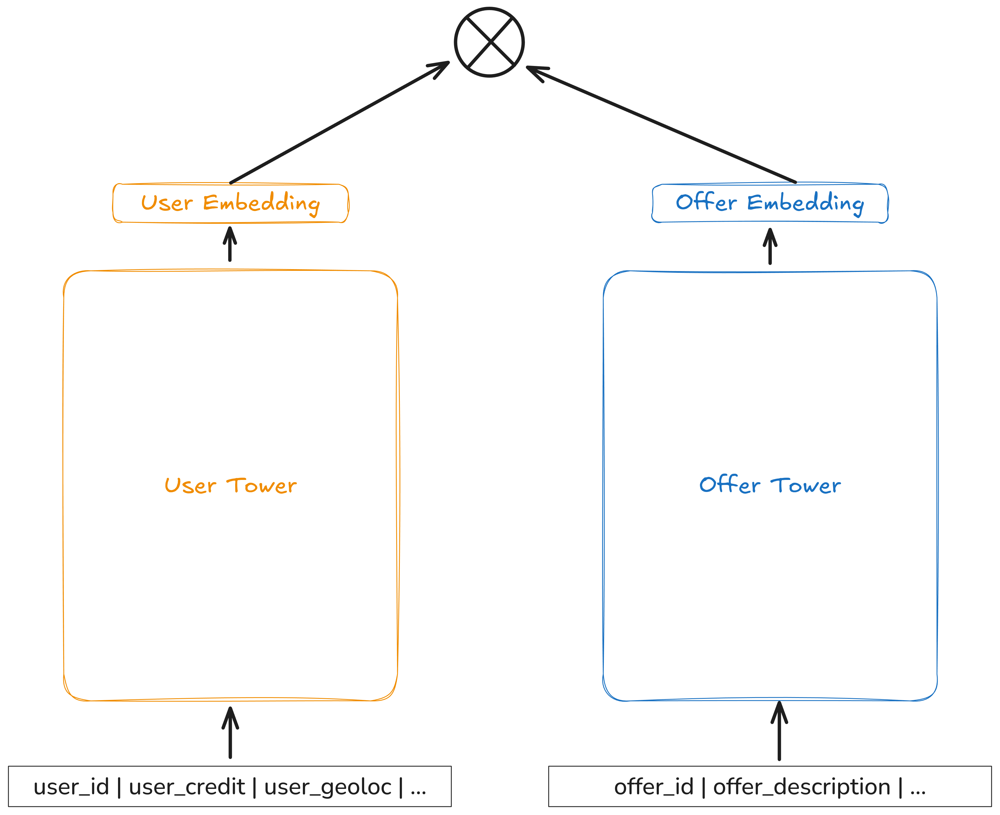
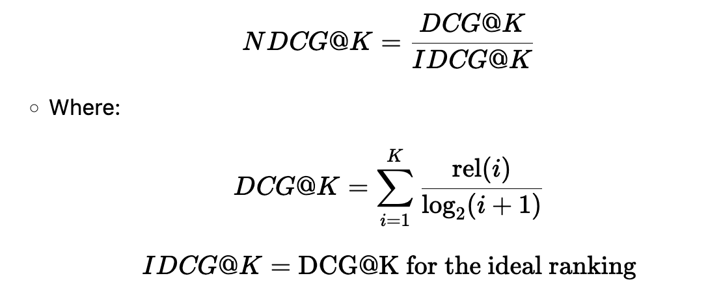

# The Pass Culture Recommendation Engine

Our recommendation engine aims to showcase relevant and personalized items from our extensive collection of 2 million cultural goods and events to our xM users.

Basically, we are training a model which allows to provide :
* Recommendations to a given user (we call it Home Recommendations)
* Similar offers to a given offer (we call it Similar Offers Recommendations)


## I. The pipeline architecture

We are using a Retrieval-Ranking model, which is a model that retrieves a list of items from a large corpus and ranks them in order of relevance to a given query, as you can see below.


Indeed, the model is composed of three parts:

* A **Retrieval model** : it retrieves a list of items from a very large corpus. Think from Millions to Hundreds.
    > The model need not to be very accurate, but it needs to be very fast and scalable.
* A **Ranking model** : it ranks the retrieved items in order of relevance to a given query. In our framework, we also use it to filter out the items that are not relevant to the user, so that we keep less than a hundred results.
    > The model need to be very accurate, but it can be slow and not scalable.
* A **Post-ranking model** : it selects offers from different categories and/or subcategories. The goal is to select a more equitable and diverse distribution of offers by categories (different artists, venues, types of offers, etc.). This combination can be done by categories, subcategories, GTL (book categorization), or by groups of clusters that have been previously trained on the semantics of the offers. The default case is clusters (500 clusters out of 4M items).


## II. The Retrieval Model

### II.A Overview

- Main Objective:
    - Extract, from a very large number of items (potentially millions), a limited subset of potentially relevant items for the user.
    - This involves retrieving candidate offers for recommendations from the pass offer catalog (~10e6). Generally, this step allows going from ***N(~1e6)*** to ***k(~1e3)*** offers. Given that the offer catalog is very large, the Retrieval is often a *less precise but fast model*. We therefore choose a ***relatively high number of candidates*** to avoid "missing" any good recommendations (i.e., with an optimization of the recall metric).
- Common Techniques
    - **Collaborative Filtering:** Uses the history of interactions (clicks, purchases, etc.) of similar users to identify items likely to interest the target user.
    - **Content-based Filtering:** Compares item attributes with user preferences or profile.
- Expected Result
    - A set of candidates (often a few hundred or thousand) that will be refined in the next step.
- What we do in practice
    - We use up to 3 retrieval models to generate the candidates for the ranking model:
        - A model based on the user's interactions with the application and his profile. The algorithm used is the Two-Tower model which is the standard in the indutry (see below).
        - A top offers model, which is a model that retrieves the most popular offers.
        - A model based on the current trends.
    - We apply this retrieval to 2 uses cases as presented above :
        - Home Recommendations : Given a user, we retrieve a list of offers that are likely to interest him.
        - Similar Offers Recommendations : Given an offer, we retrieve a list of offers that are similar to it.

### II.B The Two-Tower Model

#### Overview

The Two-Tower approach represents a hybrid recommendation strategy, allowing both to use
the strengths of collaborative filtering and content-based recommendation systems by encoding both user and item features into dense embedding vectors (towers).
It is nowadays a standard in the industry. See the orginal [Youtube Recommendation Paper](https://static.googleusercontent.com/media/research.google.com/fr//pubs/archive/45530.pdf)

#### Architecture

 architecture is as followed :

- The Two Tower Model consists in training a User Encoder (User Tower) and Item Encoder (Item Tower)
- These two encoders allow representing an item or user in the same Vector Space (therefore with N=64,128,... numbers)
- The objective is to find these 2 encoders such that in this space, a user and an item will be close if the user has or is likely to interact with the item, and distant otherwise
- This proximity or distance is defined based on a given distance or similarity measure (represented by ⓧ below). - Generally, we use Cosine Similarity, but it can also be a Euclidean Dot Product, or an L2 distance

This kind of architecture allows building on one hand, User interaction data (Collaborative Filtering), but also to take Contextual data as input, such as a user's age, credit, or an offer's description... (Content Based Filtering)




#### Training and Validation

The model is trained using a combination of user interaction data, user profile information, and item metadata.

| Training Aspects | Description |
| --- | ----------- |
|Training Process| Top-k metric, which evaluates the model's ability to rank consumed items highly among all items for a given user Optimization Goal: Maximize the rank of consumed items. |
| Validation | The model is trained using a combination of user interaction data, user profile information, and item metadata. |
| Frequency | The model is retrained on a weekly basis to ensure it stays up-to-date with user behavior and catalog changes. |
|Data Window| Booking data from the past six months and three months of click |
|**Key Distinction**| Model uses click data for training, but booking (reservation) data for Validation.|

#### Offline Metrics
To evaluate our model we use a set of standard metrics, calculate by *microsoft recommenders*.

**Recall**
> The ability of the search to find all of the relevant items in the corpus in top k items.
consider both actual relevant and non-relevant results only from the returned items.

**Precision**
> The ability to retrieve top-ranked documents that are mostly relevant in top k items.

**Coverage**
> The ratio of recommended items with respect to
the total number of items in our training catalog

**Novelty**
>Novelty measures how new, original, or unusual the recommendations are for the user.

## III. The Ranking Model

After the retrieval model has generated a list of candidates, the ranking model is used to score and rank these candidates in order of relevance to the user.

As said before, this model is more accurate but can be slower and less scalable than the retrieval model, since it is applied to a smaller number of items.
As such, we can take into account more features and more complex algorithms to predict the relevance of an item to a user.


### III.A Overview

In the context of recommendation, we try to learn the click and booking probabilities of a user for a given item.
Then the score is the sum of these two probabilities.

> Note that this score used to be more complex, but we recently got back to a simpler model, which worked better, in order to later iterate on it.


### III.B Classification model

The classification model leverages both user and item features,
such as user preferences, item metadata, and contextual information (e.g., time of day, distance to the offer).
These features are processed to train the model to distinguish between items
that are relevant to the user and those that are not.


#### Click and booking prediction

We use this model to predicts both the probability of a click
and the probability of a booking.
The final score is simply the sum of these two probabilities as show below :
    ```
    score = P(click) + P(booking)
    ```

### The Data
To train this model, we leverage all interactions performed on the app's home page, including the offers a user has viewed, clicked on, or booked.

| Training Aspects | Description |
| --- | ----------- |
| Frequency | The model is retrained on a weekly basis to ensure it stays up-to-date with user behavior and catalog changes. |
|Data Window| Booking and Click data from the past 2 weeks |

### The metrics

**Mean Average Precision (MAP@K):**

- Measures how well the ranking of relevant items is optimized.
- Computes the average precision at different cutoffs for each user and then averages across all users.
- **Formula:**
    
- Higher MAP@K values indicate better ranking of relevant items. Because this metric rewards the recommendation algorithm that puts more items at the top of the list. This is because any non-relevant items at the start of the list are factored into the aggregation at each subsequent precision@r computation.

**Normalized Discounted Cumulative Gain (NDCG@K):**

- Measures how well relevant items are ranked, giving higher importance to top-ranked items.
- Uses Discounted Cumulative Gain (DCG) and Ideal DCG (IDCG) for normalization.
- **Formula:**

- Ensures that highly relevant items appear higher in the ranking.

---

## IV. The Post-Ranking Model

🏗️ Under Construction
