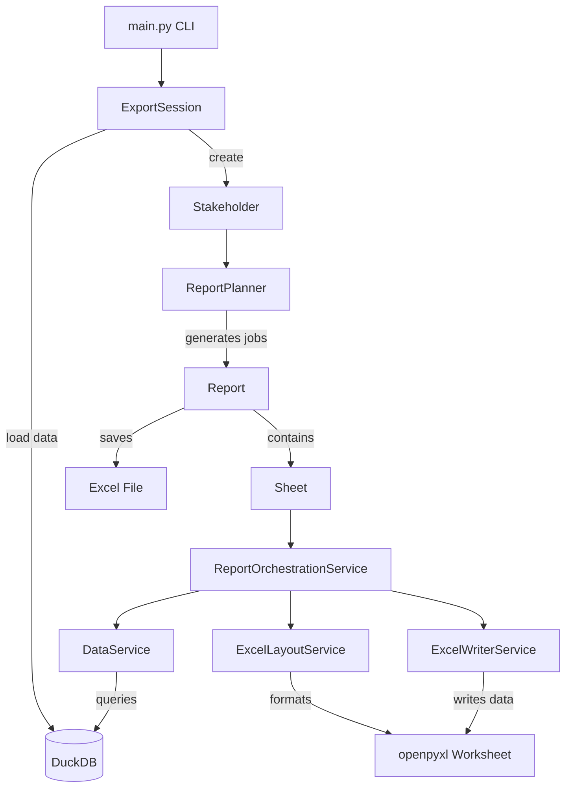

# Report Generation Module

## Overview

This module generates Excel reports for educational stakeholders (Ministry and Regional DRAC offices) by extracting KPI data from BigQuery, processing it through DuckDB, and producing formatted Excel workbooks with multiple worksheets containing both individual and collective education metrics.

## Architecture

### Core Domain Objects (`core.py`)

#### `Stakeholder`
Represents a report recipient - either Ministry (national) or DRAC (regional).
- **Type**: `MINISTERE` or `DRAC` (enum)
- **DRAC stakeholders** automatically build academy and department trees from BigQuery hierarchy
- **Ministry stakeholders** receive only national summary reports
- **DRAC stakeholders** receive regional summaries plus detailed reports for each academy/department

#### `Sheet`
Represents a single worksheet within an Excel report.
- **Definition**: Links to template tab and determines sheet type (KPI, top rankings, lexique)
- **Context**: Dimensional context (national/regional/academy/department values)
- **Filters**: Scale and scope settings that determine data queries
- **Worksheet**: openpyxl worksheet instance for Excel manipulation

#### `Report`
Represents a complete Excel workbook for a stakeholder.
- **Contains**: Multiple Sheet objects based on report blueprint
- **Context**: Regional/academy/department context passed to all sheets
- **Building**: Uses ReportOrchestrationService to coordinate sheet processing
- **Output**: Saves final Excel file to specified path

#### `ReportPlanner`
Determines what reports to generate for each stakeholder type.
- **Ministry**: Single national summary report
- **DRAC**: Regional summary + one report per academy + one report per department

#### `ExportSession`
Manages the entire export lifecycle with proper resource cleanup.
- **Data Loading**: Extracts BigQuery tables into DuckDB memory database
- **Processing**: Coordinates stakeholder processing and report generation
- **Cleanup**: Ensures DuckDB connections are properly closed

### Service Layer (`services/`)

#### `DataService` (`data.py`)
Handles all data retrieval and aggregation logic.
- **KPI Data**: Queries yearly and monthly KPI aggregations
- **Top Rankings**: Retrieves top N entities by various metrics
- **Aggregation**: Supports multiple aggregation types (sum, avg, max, december, august)

#### `ExcelLayoutService` (`excel_layout.py`)
Manages Excel worksheet formatting and layout.
- **Date Expansion**: Dynamically creates date columns based on consolidation date
- **Title Setting**: Places titles with proper positioning and merging
- **Template Cleanup**: Removes template artifacts after processing

#### `ExcelWriterService` (`excel_writer.py`)
Handles writing data to Excel cells.
- **KPI Data**: Maps yearly/monthly data to proper date columns
- **Top Data**: Writes ranking tables with proper formatting
- **Value Handling**: Manages different data types and null values

#### `ReportOrchestrationService` (`orchestration.py`)
Coordinates the complete report generation process.
- **Sheet Processing**: Manages layout preprocessing, data filling, and error recovery
- **KPI Processing**: Parses KPI definitions from Excel and fills data
- **Error Handling**: Provides comprehensive error recovery and statistics

### Utility Layer (`utils/`)

#### `data_utils.py`
Data processing and BigQuery integration utilities.
- **Region Hierarchy**: Builds nested region → academy → department mappings
- **Data Sanitization**: Handles date fields and numeric type conversion
- **Region Selection**: Interactive region selection for DRAC stakeholders

#### `duckdb_utils.py`
DuckDB query helpers and aggregation functions.
- **Query Builders**: Constructs parameterized queries for KPIs and rankings
- **Aggregation Logic**: Implements various temporal aggregation strategies
- **Error Handling**: Provides query-specific exception handling

#### `file_utils.py`
File system operations and path management.
- **Path Safety**: Creates filesystem-safe names preserving French characters
- **Directory Creation**: Builds dated directory structures
- **Date Handling**: Manages consolidation date formatting

### Configuration (`config.py`)

Centralized configuration including:
- **Data Sources**: BigQuery table definitions and mappings
- **Report Blueprints**: Defines which sheets go in which reports
- **Sheet Definitions**: Maps sheet types to templates and data sources
- **Layout Configuration**: Excel positioning and styling rules
- **Aggregation Mappings**: Maps Excel labels to technical aggregation types

## Module Structure

```
.
├── __init__.py
├── reports/
├── config.py                  # Configuration and constants
├── core.py                    # Domain objects and main orchestration
├── main.py                    # CLI entry point
├── pyproject.toml
├── requirements.in
├── requirements.txt
├── services/                  # Service layer
│   ├── __init__.py
│   ├── data.py               # Data retrieval and aggregation
│   ├── excel_layout.py       # Excel formatting and layout
│   ├── excel_writer.py       # Writing data to Excel
│   └── orchestration.py      # Report generation orchestration
├── templates/
│   └── export_template.xlsx  # Excel template file
└── utils/                     # Utility functions
    ├── __init__.py
    ├── data_utils.py          # BigQuery and data processing
    ├── duckdb_utils.py        # DuckDB query helpers
    └── file_utils.py          # File system operations
```

## Workflow

### Command Line Interface (`main.py`)

```bash
python main.py --stakeholder [all|ministere|drac] --ds YYYY-MM-DD --target "region names"
```

**Arguments:**
- `--stakeholder/-s`: Target audience
  - `all`: Generate reports for ministry + all regions
  - `ministere`: Generate only national summary
  - `drac`: Generate reports for specific regions (requires --target)
- `--ds`: Consolidation date (defaults to first day of current month)
- `--target/-t`: Space-separated region names (only for drac stakeholder)

### Execution Flow

1. **Argument Processing**
   - Validates stakeholder type and target regions
   - Sets up output directory structure by date

2. **Data Loading Phase**
   - Creates DuckDB in-memory database
   - Loads relevant BigQuery tables with data sanitization
   - Creates indexes for query performance

3. **Report Generation Phase**
   - **Ministry Processing** (if selected):
     - Creates Ministry stakeholder
     - Generates single national summary report
   - **Regional Processing** (if selected):
     - For each selected region:
       - Creates DRAC stakeholder with academy/department trees
       - Uses ReportPlanner to determine report jobs
       - Generates regional summary + detailed academy/department reports

4. **Individual Report Building**
   - Load Excel template workbook
   - Create Sheet objects based on report blueprint
   - For each sheet:
     - **Layout Preprocessing**: Expand date columns for KPI sheets
     - **Title Setting**: Add contextual titles
     - **Data Filling**: Query and write KPI or ranking data
   - Save final Excel file

### Data Flow

```
BigQuery Tables → DuckDB Memory → DataService Queries → Excel Worksheets
```

1. **Extract**: BigQuery tables loaded into DuckDB with type sanitization
2. **Transform**: DuckDB queries aggregate data by dimensions and time periods
3. **Load**: Aggregated data written to Excel with proper formatting

## Object Relationships



## Usage Examples

```bash
# Generate all reports (ministry + all regions)
python main.py --stakeholder all --ds 2024-03-01

# Generate only ministry report
python main.py --stakeholder ministere --ds 2024-03-01

# Generate reports for specific regions
python main.py --stakeholder drac --target "ile-de-france normandie" --ds 2024-03-01

# Use default date (current month)
python main.py --stakeholder ministere
```

## Configuration

### Environment Variables
- `PROJECT_NAME`: GCP project ID (default: passculture-data-prod)
- `ENV_SHORT_NAME`: Environment suffix (default: prod)

### Key Configuration Sections

#### Report Blueprints
Defined in `REPORTS` dict, specifies which sheets belong to each report type:
- `national_summary`: Ministry reports
- `region_summary`: Regional overview reports
- `academy_detail`: Academy-specific reports
- `department_detail`: Department-specific reports

#### Sheet Definitions
Maps sheet types to Excel templates and data sources:
- `individual_kpis`: Individual user metrics
- `collective_kpis`: Educational institution metrics
- `top_*`: Various ranking sheets
- `lexique`: Glossary/legend sheet

#### Data Sources
Maps logical table names to BigQuery tables:
- `individual`: Individual user data
- `collective`: Educational institution data
- `top_*`: Pre-aggregated ranking data

## Areas for Future Improvement

### Architecture
- **Decouple services**: Reduce interdependencies between classes
- **Extract interfaces**: Define clear contracts between layers
- **Separate concerns**: Split large classes into focused components
- **Add dependency injection**: Make testing and mocking easier

### Performance
- **Lazy loading**: Only load required BigQuery data based on stakeholder needs
- **Parallel processing**: Generate multiple reports concurrently
- **Connection pooling**: Reuse database connections across reports
- **Incremental updates**: Cache and reuse unchanged data

### Code Quality
- **Add comprehensive tests**: Unit tests for services, integration tests for workflows
- **Improve error handling**: Consistent exception hierarchy and recovery strategies
- **Add input validation**: Validate all external inputs and configuration
- **Extract configuration**: Move hardcoded values to config files

### Maintainability
- **Type safety**: Add stricter type hints and use mypy for validation
- **Documentation**: Add detailed docstrings and architectural documentation
- **Logging**: Structured logging with different levels and contexts
- **Monitoring**: Add metrics and health checks for production usage

### Scalability
- **Database abstraction**: Support multiple database backends
- **Template engine**: Make Excel templates more configurable
- **Plugin architecture**: Allow custom report types and data sources
- **API interface**: Expose functionality through REST/GraphQL API

## Installation and Setup

```bash
# Install dependencies
pip install -r requirements.txt

# Set up Google Cloud credentials
export GOOGLE_APPLICATION_CREDENTIALS=/path/to/service-account.json

# Run the application
python main.py --help
```

## Dependencies

### Core Dependencies
- `google-cloud-bigquery`: BigQuery data extraction
- `duckdb`: In-memory data processing
- `openpyxl`: Excel file manipulation
- `pandas`: Data manipulation
- `typer`: CLI interface
- `treelib`: Hierarchical data structures

### Utility Dependencies
- `python-dateutil`: Date parsing and manipulation
- `pathlib`: Modern path handling
- `logging`: Application logging
