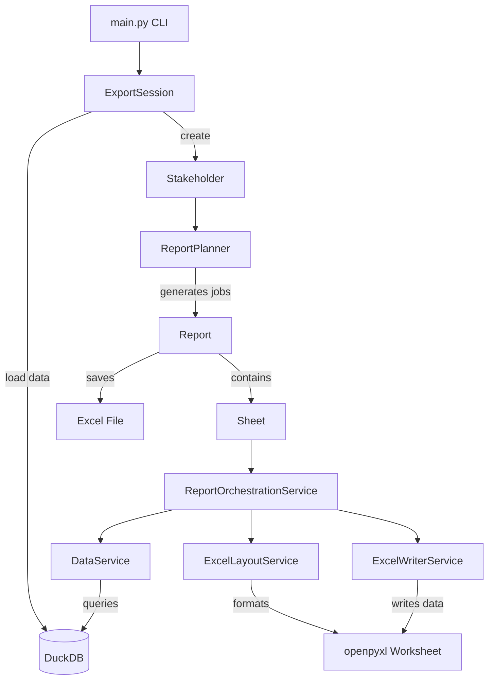

# Report Generation Module

## Overview

This module generates Excel reports for stakeholders (Ministry and Regional DRAC offices) by extracting KPI data from BigQuery, processing it through DuckDB, and producing formatted Excel workbooks with multiple worksheets containing both individual and collective education metrics.
It relies on the existence of a formated report templates/export_template.xlsx

## Quickstart

### Dependencies

- Python 3.10+
- `uv` package manager
- Google Cloud Platform access with BigQuery permissions

### Installation and Setup

```bash
# Install dependencies
make install

# Set up Google Cloud credentials: authenticate with gcp_admin_account
gcloud auth application-default login

# Source your virtual env
source .venv/bin/activate
```

## Workflow

# Command Line Interface

The CLI provides three main commands: generate, compress, and upload.
make sure you have activated the virtual env and are authenticated (see previous section)

Generate Reports

```bash
python main.py generate [OPTIONS]
```

Optional Arguments:

- -v, --verbose: Enable verbose output with detailed logging, MUST be passed after main.py
- -s, --stakeholder [all|ministere|drac]: Target stakeholder type default all
  - all: Generate reports for ministry + all regions
  - ministere: Generate only national summary
  - drac: Generate reports for specific regions (requires --target)
- --ds YYYY-MM-DD: Consolidation date (default: first day of current month)
- -t, --target "region names": Space-separated region names (required when --stakeholder drac)
- -f, --show-failures: Display detailed failure analysis for failed KPIs/tops
- --store-stats: Save execution statistics to reports/report_stats_YYYYMMDD.txt

Compress Reports

```bash
python main.py compress [OPTIONS]
```

Optional Arguments:

- -v, --verbose: Enable verbose output with detailed logging, MUST be passed after main.py
- --ds YYYY-MM-DD: Consolidation date to locate directory (default: current month)
- -d, --base-dir PATH: Base directory to compress (if different from default)
- -C, --clean: Remove source directory after compression

Upload to GCS

```bash
python main.py upload [OPTIONS]
```

Optional Arguments:

- -v, --verbose: Enable verbose output with detailed logging, MUST be passed after main.py
- --ds YYYY-MM-DD: Consolidation date to find zip file (default: current month)
- -b, --bucket NAME: GCS bucket name (uses default if not specified)
- -d, --destination PATH: Destination path in bucket (default: ppg_reports)

Usage Examples
Generate Command

```bash
# Generate all reports with default date
python main.py generate -s all

# Generate ministry report for specific date
python main.py generate -s ministere --ds 2024-03-01

# Manually choose regions to generate reports for
python main.py generate -s drac

# Generate specific regional reports with detailed output
python main.py --verbose generate -s drac -t "ile-de-france normandie" --ds 2024-03-01

# Generate with failure analysis and save statistics
python main.py generate -s all --show-failures --store-stats

# Use current month (default)
python main.py generate -s ministere
```

Compress Command

```bash
# Compress current month's reports
python main.py compress

# Compress specific month
python main.py compress --ds 2024-03-01

# Compress and remove source directory
python main.py compress --ds 2024-03-01 --clean

# Compress custom directory
python main.py compress --base-dir /path/to/reports
```

Upload Command

```bash
# Upload reports to default bucket
python main.py upload

# Upload up to specific month to custom bucket
python main.py upload --ds 2024-03-01 --bucket my-gcs-bucket

# Upload to custom destination path
python main.py upload --destination custom_folder/reports
```

Debug reports:

```bash
# Generate with verbose output and failure details
python main.py --verbose generate -s drac -t "normandie" -v --show-failures --store-stats
```

### Configuration (`config.py`)

Centralized configuration including:

- **Data Sources**: BigQuery table definitions and mappings
- **Report Blueprints**: Defines which sheets go in which reports
- **Sheet Definitions**: Maps sheet types to templates and data sources
- **Layout Configuration**: Excel positioning and styling rules
- **Aggregation Mappings**: Maps Excel labels to technical aggregation types

## Architecture

### Core Domain Objects (`core.py`)

#### `Stakeholder`

Represents a report recipient - either Ministry (national) or DRAC (regional).

- **Type**: `MINISTERE` or `DRAC` (enum)
- **DRAC stakeholders** automatically build academy and department trees from BigQuery hierarchy
- **Ministry stakeholders** receive only national summary reports
- **DRAC stakeholders** receive regional summaries plus detailed reports for each academy/department

#### `Sheet`

Represents a single worksheet within an Excel report.

- **Definition**: Links to template tab and determines sheet type (KPI, top rankings, lexique)
- **Context**: Dimensional context (national/regional/academy/department values)
- **Filters**: Scale and scope settings that determine data queries
- **Worksheet**: openpyxl worksheet instance for Excel manipulation

#### `Report`

Represents a complete Excel workbook for a stakeholder.

- **Contains**: Multiple Sheet objects based on report blueprint
- **Context**: Regional/academy/department context passed to all sheets
- **Building**: Uses ReportOrchestrationService to coordinate sheet processing
- **Output**: Saves final Excel file to specified path

#### `ReportPlanner`

Determines what reports to generate for each stakeholder type.

- **Ministry**: Single national summary report
- **DRAC**: Regional summary + one report per academy + one report per department

#### `ExportSession`

Manages the entire export lifecycle with proper resource cleanup.

- **Data Loading**: Extracts BigQuery tables into DuckDB memory database
- **Processing**: Coordinates stakeholder processing and report generation
- **Cleanup**: Ensures DuckDB connections are properly closed

### Service Layer (`services/`)

#### `DataService` (`data.py`)

Handles all data retrieval and aggregation logic.

- **KPI Data**: Queries yearly and monthly KPI aggregations
- **Top Rankings**: Retrieves top N entities by various metrics
- **Aggregation**: Supports multiple aggregation types (sum, avg, max, december, august)

#### `ExcelLayoutService` (`excel_layout.py`)

Manages Excel worksheet formatting and layout.

- **Date Expansion**: Dynamically creates date columns based on consolidation date
- **Title Setting**: Places titles with proper positioning and merging
- **Template Cleanup**: Removes template artifacts after processing

#### `ExcelWriterService` (`excel_writer.py`)

Handles writing data to Excel cells.

- **KPI Data**: Maps yearly/monthly data to proper date columns
- **Top Data**: Writes ranking tables with proper formatting
- **Value Handling**: Manages different data types and null values

#### `ReportOrchestrationService` (`orchestration.py`)

Coordinates the complete report generation process.

- **Sheet Processing**: Manages layout preprocessing, data filling, and error recovery
- **KPI Processing**: Parses KPI definitions from Excel and fills data
- **Error Handling**: Provides comprehensive error recovery and statistics

### Utility Layer (`utils/`)

#### `data_utils.py`

Data processing and BigQuery integration utilities.

- **Region Hierarchy**: Builds nested region → academy → department mappings
- **Data Sanitization**: Handles date fields and numeric type conversion
- **Region Selection**: Interactive region selection for DRAC stakeholders

#### `duckdb_utils.py`

DuckDB query helpers and aggregation functions.

- **Query Builders**: Constructs parameterized queries for KPIs and rankings
- **Aggregation Logic**: Implements various temporal aggregation strategies
- **Error Handling**: Provides query-specific exception handling

#### `file_utils.py`

File system operations and path management.

- **Path Safety**: Creates filesystem-safe names preserving French characters
- **Directory Creation**: Builds dated directory structures
- **Date Handling**: Manages consolidation date formatting

### Configuration (`config.py`)

Centralized configuration including:

- **Data Sources**: BigQuery table definitions and mappings
- **Report Blueprints**: Defines which sheets go in which reports
- **Sheet Definitions**: Maps sheet types to templates and data sources
- **Layout Configuration**: Excel positioning and styling rules
- **Aggregation Mappings**: Maps Excel labels to technical aggregation types

## Module Structure

```
.
├── __init__.py
├── reports/
├── config.py                  # Configuration and constants
├── core.py                    # Domain objects and main orchestration
├── main.py                    # CLI entry point
├── pyproject.toml
├── requirements.in
├── requirements.txt
├── services/                  # Service layer
│   ├── __init__.py
│   ├── data.py               # Data retrieval and aggregation
│   ├── excel_layout.py       # Excel formatting and layout
│   ├── excel_writer.py       # Writing data to Excel
│   ├── orchestration.py      # Report generation orchestration
│   └── tracking.py           # Report statistics generator
├── templates/
│   └── export_template.xlsx  # Excel template file
└── utils/                     # Utility functions
    ├── __init__.py
    ├── data_utils.py          # BigQuery and data processing
    ├── duckdb_utils.py        # DuckDB query helpers
    ├── file_utils.py          # File system operations
    └── verbose_logger.py       # Centralized logger with CLI verbose support
```

### Execution Flow

1. **Argument Processing**

   - Validates stakeholder type and target regions
   - Sets up output directory structure by date
2. **Data Loading Phase**

   - Creates DuckDB in-memory database
   - Loads relevant BigQuery tables with data sanitization
   - Creates indexes for query performance
3. **Report Generation Phase**

   - **Ministry Processing** (if selected):
     - Creates Ministry stakeholder
     - Generates single national summary report
   - **Regional Processing** (if selected):
     - For each selected region:
       - Creates DRAC stakeholder with academy/department trees
       - Uses ReportPlanner to determine report jobs
       - Generates regional summary + detailed academy/department reports
4. **Individual Report Building**

   - Load Excel template workbook
   - Create Sheet objects based on report blueprint
   - For each sheet:
     - **Layout Preprocessing**: Expand date columns for KPI sheets
     - **Title Setting**: Add contextual titles
     - **Data Filling**: Query and write KPI or ranking data
   - Save final Excel file
5. **Report Statistics**

- Track success & failures
- Optionnally saves it on .txt file for debugging

### Data Flow

```
BigQuery Tables → DuckDB Memory → DataService Queries → Excel Worksheets
```

1. **Extract**: BigQuery tables loaded into DuckDB with type sanitization
2. **Transform**: DuckDB queries aggregate data by dimensions and time periods
3. **Load**: Aggregated data written to Excel with proper formatting

## Object Relationships



## Configuration

### Environment Variables

The virtual environment automatically sets:

- GCP_PROJECT="passculture-data-prod"
- ENV_SHORT_NAME="prod"

(Existing variables are backed up on activation and restored on deactivation.)

### Key Configuration Sections

#### Report Blueprints

Defined in `REPORTS` dict, specifies which sheets belong to each report type:

- `national_summary`: Ministry reports
- `region_summary`: Regional overview reports
- `academy_detail`: Academy-specific reports
- `department_detail`: Department-specific reports

#### Sheet Definitions

Maps sheet types to Excel templates and data sources:

- `individual_kpis`: Individual user metrics
- `collective_kpis`: Educational institution metrics
- `top_*`: Various ranking sheets
- `lexique`: Glossary/legend sheet

#### Data Sources

Maps logical table names to BigQuery tables:

- `individual`: Individual user data
- `collective`: Educational institution data
- `top_*`: Pre-aggregated ranking data

## Areas for Future Improvement

### Architecture

- **Decouple services**: Reduce interdependencies between classes
- **Extract interfaces**: Define clear contracts between layers
- **Separate concerns**: Split large classes into focused components
- **Add dependency injection**: Make testing and mocking easier

### Performance

- **Lazy loading**: Only load required BigQuery data based on stakeholder needs
- **Parallel processing**: Generate multiple reports concurrently
- **Incremental updates**: Cache and reuse unchanged data

### Code Quality

- **Add comprehensive tests**: Unit tests for services, integration tests for workflows
- **Improve error handling**: Consistent exception hierarchy and recovery strategies
