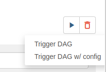
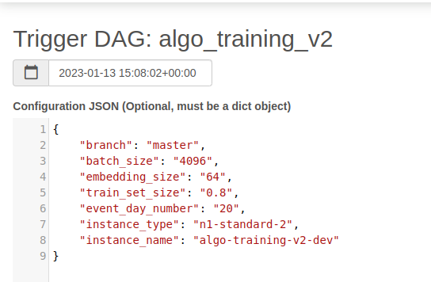

## Algo Training

Les scripts d'entraînement de l'algorithme sont exécutés via les DAG Airflow `orchestration/dags/algo_training<XXX>.py`, sur
une machine Google Compute Engine :

- algo-training-dev (projet passculture-data-ehp)
- algo-training-stg (projet passculture-data-ehp )
- algo-training-prod (projet passculture-data-prod)

NB: verifier que la VM sur laquelle on effectue le test a bien les droits de lecture sur les tables requêter pour récupérer la donnée d'entrainement.

On peut les tester de la façon suivante (les commandes sont écrites pour l'environnement de dev) :

- démarrer la VM GCE
- on se ssh sur la VM correspondante depuis la cloudshell : `gcloud compute ssh airflow@algo-training-dev`
- on définit les variables d'environnement nécessaires :
  - `export STORAGE_PATH=gs://data-bucket-dev/test_training`
  - `export ENV_SHORT_NAME=ehp`
  - `export GCP_PROJECT_ID=passculture-data-ehp`
- on pull la dernière version du code : `git pull`
- on se place sur la branche où les nouvelles features sont en développement : `git checkout <nom-de-ma-branche>`
- on exécute les scripts exécutés par Airflow : `python data_collect.py`, `python preprocess.py`
- on vérifie les logs sur MLflow :
  - pour le projet ehp : [mlflow.staging.passculture.team](https://mlflow.staging.passculture.team)
  - pour le projet prod : [mlflow.passculture.teamp](https://mlflow.passculture.teamp)
  - [Notion](https://www.notion.so/passcultureapp/Mlflow-1dbb2d3ec71e43cb871a5c389b79e753#bfa1e789cfd245e79bd6f2cecd11deda)

## Test du DAG algo_training en dev

Afin de tester le code sur l'environnement de développement, il faut modifier le nom de la branche utilisée en 
développement dans le DAG concerné. Les deux possibilités sont de :

- Faire la modification directement dans les paramètres du DAG
- Sur l'interface graphique d'Airflow, lancer le DAG avec l'option "trigger DAG w/ config"

De plus, afin de réduire les temps d'entraînement et d'évaluation, on peut réduire le volume de données utilisées en 
diminuant le nombre de jours utilisés pour l'entraînement : paramètre `event_day_number`.