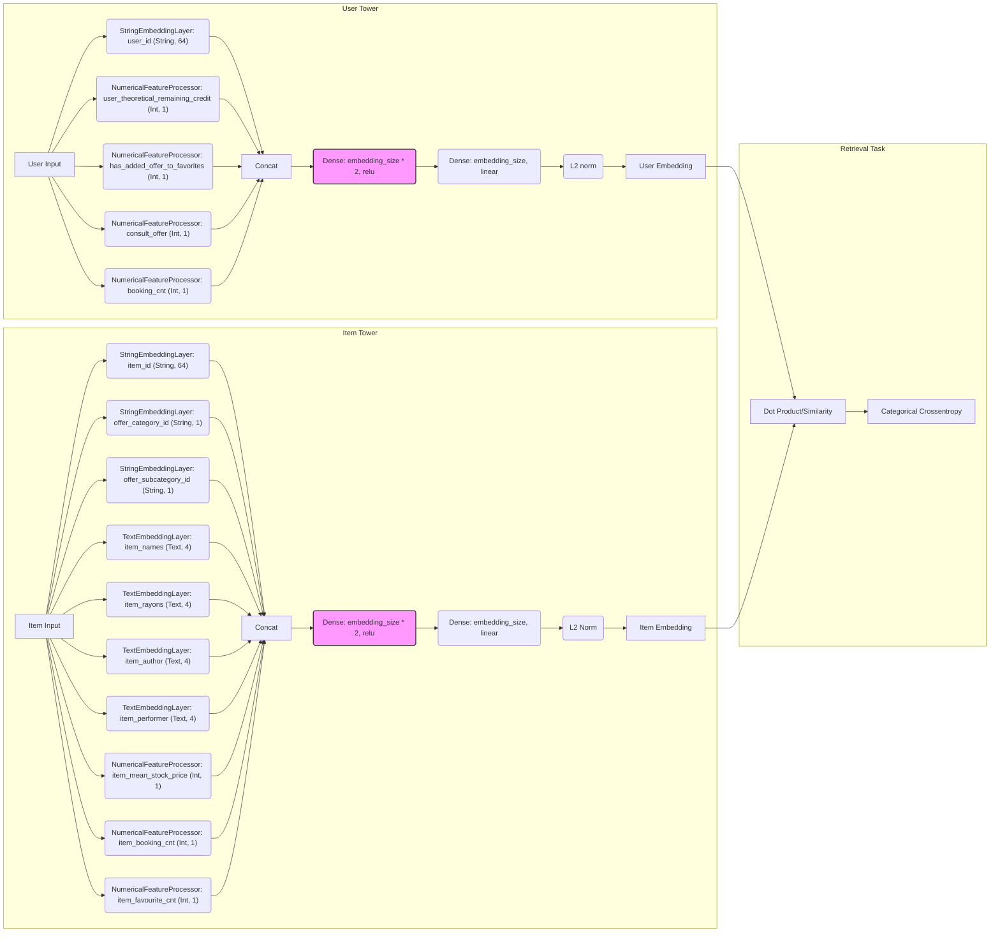
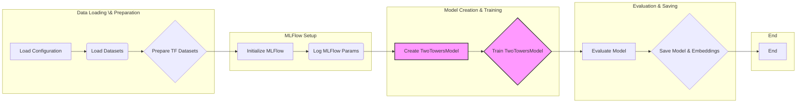

# Two-Tower Model

[](https://opensource.org/licenses/MIT)

## Overview

This directory contains the code for training and deploying a two-tower model for recommendation systems. The model is implemented using TensorFlow Recommenders (TFRS) and leverages MLFlow for experiment tracking. It's designed to generate user and item embeddings, which can then be used for efficient item retrieval based on user preferences or similar items. This README provides a detailed explanation of the model architecture, training pipeline, and deployment process. The two tower model is similar to the one in [TFRS tutoriel](https://www.tensorflow.org/recommenders/examples/basic_retrieval)

## Key Features

-   **Two-Tower Architecture:** Separates user and item feature processing into two separeate single towers.
-   **TensorFlow Recommenders:** Utilizes TFRS for model building, training, and evaluation.
-   **MLFlow Integration:** Tracks experiments, parameters, metrics, and artifacts.
-   **Configurable Embeddings:** Supports different embedding layer types (string, int, text, pretrained) defined via JSON configuration files.
-   **BigQuery Integration:** Reads training and validation data from BigQuery tables.
-   **GPU Acceleration:** Optimized for GPU training with memory growth enabled.
-   **Embeddings Historization:** Save user and item embeddings in partitionned BigQuery table.


## Configuration

The model's behavior is configured using JSON files located in the `configs` directory. The main configuration file specifies the features to use for user and item embeddings.

Example structure of a feature configuration file (`config.json`):

```
{
"user_embedding_layers": {
                        "user_id": {
                                    "type": "string",
                                    "embedding_size": 64
                                    },
                        ...
}
},
"item_embedding_layers": {
                        "item_id": {
                                    "type": "string",
                                    "embedding_size": 64
                                    },
                        ...
}
```

## Model Architecture

The two-tower model consists of two separate neural networks: a user single tower and an item single tower. Each tower processes the features associated with users and items (the ones defined in the json file), respectively, and generates embeddings for the users and the items of the same size defined by the parameter `embedding_size`* . The model then leverages these embeddings to compute the similarity between user and item embeddings to predict the likelihood of a user interacting with an item by doing a dot product between item and user embedding.

*: *note that there are two parameters named `embedding_size`, one is for the size of the user and item final embedding vector that is created at the end of each single tower. And another `embedding size` defined for each feature type in the config file.*

Below is an example architecture of the two-tower model with features from `default-features.json` as of March 2025. Please review yourself current architecture and not rely entirely on this graph:


### Explanation:

-   **User Tower:**
    -   Takes user features as input.
    -   Applies embedding layers defined in `utils/layers.py` to each feature. The data type and size of these features are defined in the configuration file. According to the feature data type, an embedding layer is used to embed the feature.
    -   Concatenates the embeddings in one vector.
    -   Passes the concatenated  feature embedding vector through two dense layers to produce the final user embedding of size `embedding_size`.
    - Normalizes with l2 normalize the final embedding vector
-   **Item Tower:**
    -  Same as User Tower but with item features.
-   **Retrieval Task:**
    -   It refers to the training objective.
    -   For each batch of N user-item interactions, it will :
        - Computes the similarity between user and item embeddings (dot product) for all user and items in the given batch. It will then give you a Matrix of size NxN, assuming that you have only N unique items and offers in this batch.
        - Then it will compare it to an identity matrix
        - Applies a `CategoricalCrossentropy` loss function to optimize the model.
        - Uses the similarity score to predict the likelihood of user-item interaction.
        >  - The similarity between user and item embeddings is computed by doing a matmul which is equivalent to a dot product and also a cosine since our embeddings are normalized
        >  - The assumption of unique item and offers per batch is known to be False but in practice, it also helps the model regularizing.


## Training Pipeline

The training pipeline involves loading data from BigQuery, preparing TensorFlow datasets, training the two-tower model, and evaluating its performance. MLFlow is used to track experiments and log relevant metrics.



### Steps:

1.  **Load Configuration:** Reads the feature configuration from a JSON file.
2.  **Load Datasets:** Loads training and validation data from BigQuery tables.
3.  **Prepare TF Datasets:** Creates TensorFlow datasets for training, validation, users, and items.
4.  **Initialize MLFlow:** Sets up MLFlow for experiment tracking.
5.  **Log MLFlow Params:** Logs parameters such as embedding size, batch size, and data statistics to MLFlow.
6.  **Create TwoTowersModel:** Initializes the two-tower model with the loaded configurations and data.
7.  **Train TwoTowersModel:** Trains the model using the prepared datasets.
8.  **Evaluate Model:** Evaluates the trained model on both training and validation data.
9.  **Save Model & Embeddings:** Saves the trained model and the resulting user and item embeddings.


## Save Model & Embeddings with MatchModel for Deployment and Prediction

After the Two-Tower model is trained, a `MatchModel` is created and used for efficient deployment and prediction. The `MatchModel` encapsulates the learned user and item embeddings from the trained Two-Tower model and provides a simplified interface for making user-item match predictions.

### Role of MatchModel

 The `MatchModel` stores pre-computed user and item embeddings extracted from the trained `TwoTowersModel`. It allows for fast user-item match score calculations using a dot product between user and item embeddings. It simplifies deployment by providing a standalone model that only requires user and item IDs as input and outputs a match score.

### Creation and Embedding Transfer

The `MatchModel` is created and populated after the `TwoTowersModel` training is complete:

1.  **Embedding Extraction:** User and item embeddings are extracted from the trained `TwoTowersModel`.

2.  **`MatchModel` Instantiation:** A `MatchModel` instance is created with the user and item ID vocabularies and the embedding size. All users and items in the training and validation sets are used to populate the matchmodel.

    ```
    match_model = MatchModel(
        user_input=train_user_data.iloc[:, 0].unique(),
        item_ids=train_item_data["item_id"].unique(),
        embedding_size=embedding_size,
    )
    ```

3.  **Embedding Setting:** The extracted user and item embeddings are then transferred to the `MatchModel` using the `set_embeddings` method:

    ```
    match_model.set_embeddings(
        user_embeddings=user_embeddings, item_embeddings=item_embeddings
    )
    ```

4.  **Saving the Model:** The `MatchModel`, now containing the learned embeddings, is saved as a standalone TensorFlow model for deployment in the mlflow experiment.

### Prediction with MatchModel

Once deployed, the `MatchModel` takes user and item IDs as input and returns a match score which represents the predicted affinity between the user and the item.
:
```
user_id = "some_user_id"
item_id = "some_item_id"
match_score = match_model([np.array([user_id]), np.array([item_id])])
```


## Usage

To train the model, run the `train.py` script with the necessary parameters:

```

python two_towers_model/train.py \
--experiment_name your_experiment_name \
--config_file_name your_config_file \
--batch_size 256 \
--embedding_size 64 \
--training_table_name your_training_table \
--validation_table_name your_validation_table

```

### Parameters:

-   `--experiment_name`: The name of the MLFlow experiment.
-   `--config_file_name`: The name of the configuration file (without the `.json` extension).
-   `--batch_size`: The batch size used for training.
-   `--embedding_size`: The size of the user and item embeddings.
-   `--seed`: Random seed for reproducibility.
-   `--training_table_name`: The BigQuery table containing the training data.
-   `--validation_table_name`: The BigQuery table containing the validation data.
-   `--run_name`: Name of the MLflow run if set


## Evaluation of Two Tower model

The evaluation system of the Two-Tower model consists in computing the following metrics with the [recommenders](https://github.com/recommenders-team/recommenders/tree/main/recommenders/evaluation) library:
- Precision@k
- Recall@k
- Catalog Coverage
- Novelty

### Main Evaluation Script (`evaluate.py`)
This script handles the MLflow integration and orchestrates the evaluation process. It:
- Loads the trained model from MLflow
- Computes the aforementionned metrics on test data
- Generates PCA visualizations of item embeddings
- Logs evaluation results and PCA visualizations back to MLflow
- Supports evaluation with different top-k values
- Supports evaluation on all users or a subset of users.
- Can evaluate against random and popularity-based baselines.

#### Baselines
- Random baseline: generates random prediction item for each user.
- Popularity-based baseline: generates recommendations using top q% most popular items, q being a quantile parameter. E.G. if q=0.99, then the popularity baseline model will predict items from the 0.1% most clicked and booked items.

#### Visualization
- PCA-based visualization of item embeddings
- Category and subcategory-based scatter plots

### Usage
To run the evaluation:

```bash
python evaluate.py \
    --experiment-name "your_experiment" \
    --model-name "your_model" \
    --training-dataset-name "recommendation_training_data" \
    --test-dataset-name "recommendation_test_data" \
    --list-k 10 50 100 250 1000 \
    --all-users \
    --dummy \
    --quantile-threshold 0.99
```

Key parameters:
- `experiment-name`: Name of the MLflow experiment
- `model-name`: Name of the model to evaluate
- `training-dataset-name`: Name of the training dataset in storage
- `test-dataset-name`: Name of the test dataset in storage
- `list-k`: List of k values for top-k metrics
- `all-users`: Whether to evaluate all users or a subset
- `dummy`: Whether to compute metrics for random and popularity baselines
- `quantile-threshold`: Threshold for top popular items in popularity baseline

The evaluation results will be:
1. Logged to MLflow with all computed metrics
2. Saved to BigQuery in the models results table


## Embeddings historization
After training and evaluating the two towers model, we save user and items embeddings in two partitionned BigQuery table in `raw_<env>` dataset. `<env>` is **dev**, **stg** or **prod**. Each partition corresponds one model i.e. one embedding for each user or item. The idea is to have a history of how users and items embeddings change after each training. The two tables are:
* `two_tower_user_embedding` : contains all information about the model (experiment_id, run_id, etc) and the vector embedding (64,) for each user.
* `two_tower_item_embedding`: contains all information about the model (experiment_id, run_id, etc) and the vector embedding (64,) for each item.

##### `upload_embeddings_to_bq.py` overview:

1. Load trained model of the latest MLFlow experiment which contains the url to the GCS bucket that contains the model weights.
2. Extract user (resp item) id list and user (resp item) embedding from model layers.
3. Create two dataframes one for users and another for items, each will contain all data we need to upload.
4. Use BigQuery Client to create a schema for a partionned table and specify requiered data type for each column.
5. For the data type of the embedding column, the datatype should be of type `FLOAT` with a `mode='repeated'` which guarantees that :
    * the embedding column is of type `ARRAY`
    * the embedding column is compatible with GCP functions to create `VECTOR INDEX` and later run a `VECTOR SEARCH` function over the column (which runs faster if you create a `VECTOR INDEX` on your `ARRAY` column, see doc for more information).
6. Export tables to BigQuery


For more info on how to run a `VECTOR SEARCH` function, please refer to this [Notion page ](https://www.notion.so/passcultureapp/Vector-Search-with-BigQuery-81952e07282c41f1a3640aa8bcbe0c3c?pvs=4 )and/or [GCP documentation](https://cloud.google.com/bigquery/docs/vector-index?hl=fr)
