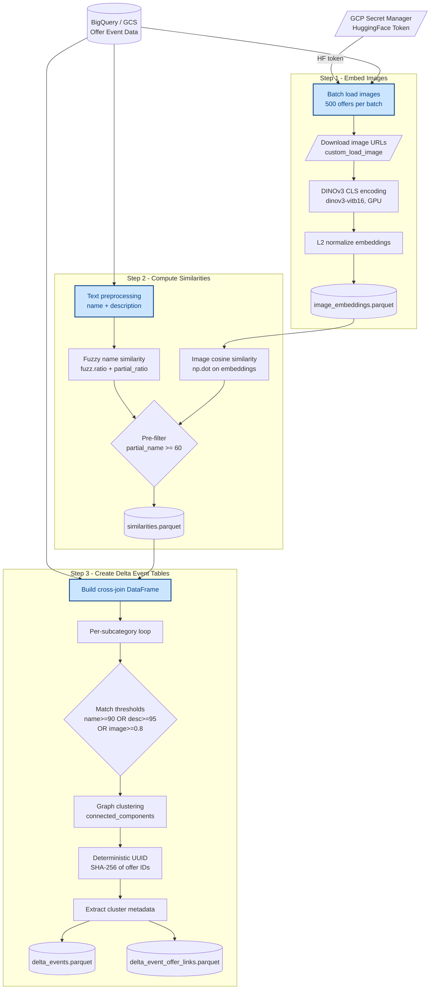

# Event Linkage

This project links similar offers into events by computing multi-modal similarities (image, name, description) and clustering matched offers together. It produces **delta event tables** that can be ingested downstream.

## Pipeline Overview

The pipeline is composed of three sequential CLI scripts located in `cli/`, each reading the output of the previous step:

```
1_embed_offer_images.py  →  2_compute_similarities.py  →  3_create_delta_event_tables.py
```



### Step 1 — Embed Offer Images

```bash
python cli/1_embed_offer_images.py \
    --offer-event-filepath <input.parquet> \
    --output-filepath <output_with_embeddings.parquet>
```

Loads a parquet file of offers, downloads each offer's image, and computes a 768-d L2-normalized CLS embedding using **DINOv3** (`facebook/dinov3-vitb16-pretrain-lvd1689m`). Images are processed in batches on GPU. The output is the original dataframe enriched with an `image_embedding` column.

### Step 2 — Compute Similarities

```bash
python cli/2_compute_similarities.py \
    --offer-event-with-embeddings-filepath <output_with_embeddings.parquet> \
    --output-filepath <similarities.parquet>
```

For each subcategory, computes pairwise similarity scores between offers:

| Metric | Method |
|--------|--------|
| **Name similarity** | `rapidfuzz.fuzz.ratio` on preprocessed offer names |
| **Partial name similarity** | `rapidfuzz.fuzz.partial_ratio` (threshold ≥ 60) |
| **Full name similarity** | `rapidfuzz.fuzz.ratio` on full lowercased names |
| **Image similarity** | Cosine similarity of image embeddings |
| **Description similarity** | `rapidfuzz.fuzz.partial_ratio` on descriptions |
| **Full description similarity** | `rapidfuzz.fuzz.ratio` on descriptions |

Only pairs exceeding the partial name similarity threshold are kept for further description comparison, reducing computation time. The output is a parquet of offer-pair similarity scores.

### Step 3 — Create Delta Event Tables

```bash
python cli/3_create_delta_event_tables.py \
    --offer-event-filepath <input.parquet> \
    --similarities-filepath <similarities.parquet> \
    --event-series-offer-link-filepath <applicative_event_series_offer_link.parquet> \
    --delta-events-filepath <delta_events.parquet> \
    --delta-event-offer-links-filepath <delta_event_offer_links.parquet>
```

Runs incrementally against the already-existing event_series (loaded from `--event-series-offer-link-filepath`, the current `event_series_id` ↔ `offer_id` links). For each subcategory, offer pairs that match on name, description, or image (depending on subcategory rules) are computed, then processed in two passes:

1. **Link to existing events** — a new offer (not yet linked to any event_series) that matches one or more already-linked offers is attached to an existing event_series, without creating a new event. If it matches offers from several event_series, it is linked to the one with the most matching offers (majority vote), tie-broken by the highest similarity score, then by `event_id`. Existing event_series are never modified, merged, or re-matched.
2. **Cluster the rest** — offers still unmatched are clustered among themselves via connected components (`networkx`), exactly as in a from-scratch run. Each cluster becomes a new event with a deterministic UUID (derived from the sorted offer IDs) and metadata extracted from the cluster representative.

Additionally, any event_series whose offers have **all** disappeared from the current input (deleted offers) is removed: both the event and its offer links are emitted with `action = "remove"`. An event_series with at least one surviving offer is left untouched.

**`--from-scratch`** — pass this flag to ignore the existing `event_series_id` ↔ `offer_id` links entirely: no offer is treated as already linked, so every offer goes through clustering instead of being attached to an existing event, and **all** existing event_series are flagged for removal (with `comment = "full_reset"` instead of `"removed_event"`). This produces a full remove-then-add delta that re-clusters every offer from scratch while still going through the normal delta mechanism. If a cluster ends up identical to an event_series that was just removed, that `event_id` is logged as removed-and-recreated. Use this to rebuild the event_series from scratch, e.g. after a change to the matching/clustering logic.

```bash
python cli/3_create_delta_event_tables.py \
    --offer-event-filepath <input.parquet> \
    --similarities-filepath <similarities.parquet> \
    --event-series-offer-link-filepath <applicative_event_series_offer_link.parquet> \
    --delta-events-filepath <delta_events.parquet> \
    --delta-event-offer-links-filepath <delta_event_offer_links.parquet> \
    --from-scratch
```

Produces two output tables:
- **delta_events** — one row per event (new or removed) with metadata and action type.
- **delta_event_offer_links** — one row per (event_id, offer_id) link (new, linked-to-existing, or removed).

Action/comment values: `action` is `add` or `remove` (`src/interfaces.py::ActionType`); `comment` is one of `new_event`, `linked_to_existing_event`, `removed_event`, `full_reset` (`src/interfaces.py::CommentType`).

## Configuration

Key thresholds are defined in `src/constants.py`:

| Parameter | Value |
|-----------|-------|
| `PARTIAL_NAME_SIMILARITY_THRESHOLD` | 60 |
| `NAME_SIMILARITY_THRESHOLD` | 90 |
| `DESCRIPTION_SIMILARITY_THRESHOLD` | 95 |
| `IMAGE_SIMILARITY_THRESHOLD` | 0.8 |

Environment variables:
- `GCP_PROJECT_ID` — GCP project (default: `passculture-data-ehp`)
- `ENV_SHORT_NAME` — Environment (`dev` / `prod`)

## Development

```bash
# Install dependencies
uv sync

# Run tests
make test
```

Requires Python ≥ 3.13. Uses `uv` for dependency management with platform-specific PyTorch indexes (CPU on macOS, CUDA 12.8 on Linux).
