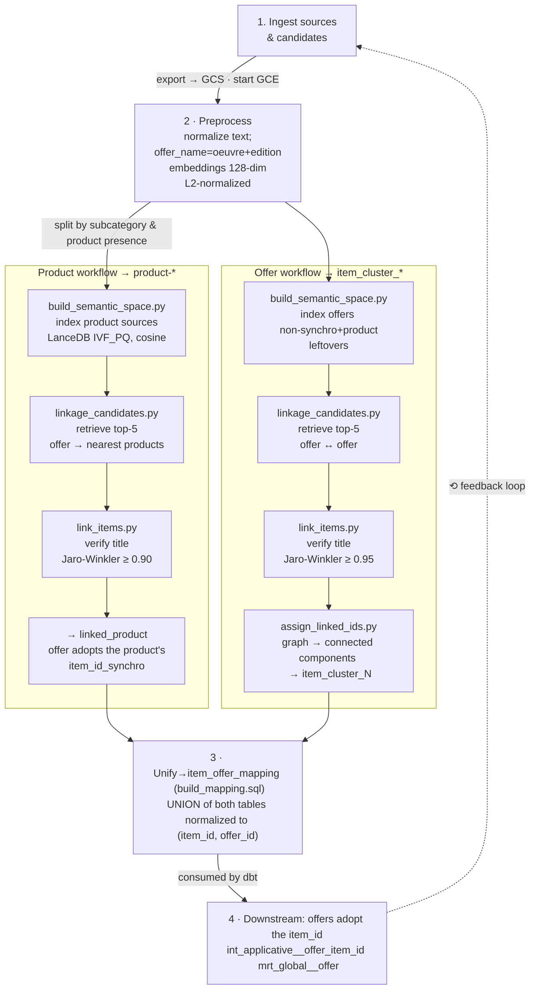

# Item Linkage Workflow

This directory contains the code and scripts for linking items (products and offers) using semantic vectors, orchestrated via Airflow and GCE.

[Detailed documentation is available on Notion](https://www.notion.so/passcultureapp/Items-Linkage-913d770e69b64f2880c98f51af447a65).

## Overview

The workflow is managed by the Airflow DAG `link_items.py`, which automates the following steps:

1. **Import Data**
   - SQL queries are run to import sources and candidates data into BigQuery temporary tables. SQL queries are in `data-gcp/orchestration/dags/dependencies/ml/linkage/sql`
   - Sources are canonical `product-*` item_ids imported from backend database AND that have offer_product_id not null.
   - Candidates are all offers that are not linked to a canonical "product-*" item_id (thus excludes sources and offers that were previously linked to a canonical `product-*` item_id though this link_items job).

2. **Export Data to GCS**
   - Data from BigQuery tables is exported as Parquet files to Google Cloud Storage.

3. **Start GCE Instance & Install Dependencies**
   - A GCE VM is started.
   - The codebase is fetched and Python dependencies are installed.

4. **Preprocess Data**
   - Run `preprocess.py` to clean and batch sources and candidates data.

5. **Linkage Workflow** (per `--linkage-type`; see the flow diagram under [Mental Model](#mental-model) for the per-script sequence)
   - Both `product` and `offer` run `prepare_tables.py` → `build_semantic_space.py` → `linkage_candidates.py` → `link_items.py`.
   - `offer` additionally runs `assign_linked_ids.py` (graph clustering into `item_cluster_*`).
   - Each result is loaded into BigQuery and scored with `evaluate.py`.

6. **Export Item Mapping**
   - Run SQL to build and export item-offer mapping to BigQuery.

7. **Stop GCE Instance**

## How to Run

The recommended way to run the workflow is via Airflow, which will handle all orchestration and dependencies.
If you want to run individual scripts manually, follow the order above and use the same arguments as in the DAG.

### Example Commands

- Preprocess data:
  ```bash
  python preprocess.py --input-path <input_parquet> --output-path <output_dir> --batch-size 100000
  ```

- Prepare tables:
  ```bash
  python prepare_tables.py --linkage-type product --input-candidates-path <candidates_parquet> --output-candidates-path <output_dir> --input-sources-path <sources_parquet> --output-sources-path <output_dir> --batch-size 100000
  ```

- Build semantic space:
  ```bash
  python build_semantic_space.py --input-path <input_parquet> --linkage-type product --batch-size 100000
  ```

- Generate linkage candidates:
  ```bash
  python linkage_candidates.py --batch-size 100000 --linkage-type product --input-path <input_parquet> --output-path <output_dir>
  ```

- Link items:
  ```bash
  python link_items.py --linkage-type product --input-sources-path <sources_dir> --input-candidates-path <candidates_dir> --linkage-candidates-path <candidates_dir> --output-path <output_dir> --unmatched-elements-path <unmatched_dir>
  ```

- Assign linked IDs (for offers):
  ```bash
  python assign_linked_ids.py --input-path <linked_offers_dir> --output-path <linked_w_id_dir>
  ```

- Evaluate linkage:
  ```bash
  python evaluate.py --input-candidates-path <candidates_dir> --linkage-path <linked_dir> --linkage-type product
  ```

## Embedding Specification

| Property | Value |
|---|---|
| Source table | `passculture-data-<env>.ml_feat_<env>.item_embedding_refactor_128` (pre-truncated) |
| Model | embedding-gemma-300m |
| Original dimension | 768 |
| Used dimension | **128** (first 128 dims, Matryoshka truncated upstream in the dbt model `ml_feat__item_embedding_128` via `ARRAY_SLICE`) |
| Normalization | L2 (applied in `preprocess.py`) |
| LanceDB index | IVF_PQ, cosine distance, `Vector(128)` |

## Notes

- All paths and parameters should match those defined in the DAG config.
- The workflow requires access to GCP resources (BigQuery, GCS, GCE).

## Mental Model

> **In one sentence:** for every catalog offer, find the ones that are really the *item* and give them one shared `item_id`, anchoring to a canonical product when one exists, otherwise minting a synthetic cluster.

The job collapses thousands of duplicate offers into shared "items".
It runs on GCE (n1-standard-32 in prod), is tracked in MLflow (`item_linkage_v2.0`), and produces `item_offer_mapping`.

### The flow — one preprocessing trunk, two linkage branches



### The core idea — three moves: recall, then precision, then identity

1. **Recall with vector retrieval.** ANN search narrows the whole catalog to a few plausible neighbors, hard-filtered to the same `edition` + `subcategory`, and bounded by a cosine-distance ceiling (`SEMANTIC_RETRIEVAL_UPPER_BOUND`). It only shortlists.
2. **Precision with fuzzy string matching.** Jaro-Winkler on the cleaned title (`oeuvre`) decides the link. This is the real gate a neighbor is only linked if titles are near-identical (similarity at least 0.9).
3. **Assembling with graph clustering.** Pairwise links become graph edges; connected components give transitive groups a single shared id (offers only).

### The output vocabulary: every `item_id` is one of three things

Priority chain in `int_applicative__offer_item_id`: we prioritize linking an offer to a catalog product **"product-"** first (products are created in the backend). If we cannot find a predetermined **product-** then we try to create a cluster **item-cluster-"** containing multiple offers. these offers will have an item-id = "item_cluster_*" (in the v1 these cluster were named "link-"). If the previous two attempts failed, then the item-id is equal to the offer-id as a standalone offer **"offer-"**.

| item_id | When | Creation | Stable? |
|---|---|---|---|
| `product-*` | The offer is attached to a canonical catalog product. | imported from backend canonical products | **Yes** — canonical id |
| `item_cluster_*` | No product, but the ML job matched it to other offers. | Inferred — semantic + fuzzy + graph. | **No** — `item_cluster_*` has a positional index *|
| `offer-*` | No product and no match — a singleton. | None — one offer, one item. | **Yes** — the offer id |

>  \* at each run, new item-cluster are created and are indexed incerementally. One offer can have an item-id='item-cluster-x' on last week's run, may have a new cluster "item_cluster_y" in this week's run. This is a known caveat and should be resolved soon.

### Thresholds & parameters

All in `constants.py`. The Jaro-Winkler gate is the one that actually decides a link.

| Parameter | Value | Role |
|---|---|---|
| Jaro-Winkler on `oeuvre` | `0.90` product · `0.95` offer | The match gate. Title similarity must clear it. |
| `MATCHES_REQUIRED` | `1` | Features that must match — only `oeuvre` is compared, so one is enough. |
| `RETRIEVAL_FILTERS` | `edition`, `offer_subcategory_id` | Exact-match constraints during vector search. |
| `NUM_RESULTS` | `5` | Neighbors retrieved per candidate. |
| `SEMANTIC_RETRIEVAL_UPPER_BOUND` | `0.3` | Cosine-distance ceiling on retrieved neighbors. |
| Vector dimension (`MODEL_TYPE["n_dim"]`) | `128` | Pre-truncated upstream & L2-normalized (no reduction in this job). |
| `N_PROBES` / `REFINE_FACTOR` | `5` / `10` | ANN recall vs accuracy knobs. |
| Cluster keep rule | edges > 1 | Drops single-edge clusters (may also drop simple pairs). |

### The two BigQuery outputs — `linked_product` vs `linked_offer`

Both live in the sandbox dataset, rebuilt every run. They are *not* the same shape.

| `linked_product` | `linked_offer` |
|---|---|
| **Pairwise** — one row per matched pair to a real **"product-\*"** from the catalog. | **Flattened** — one row per offer → its cluster **"item_cluster_\*"** created by this job. |
| Direct output of `link_items.py`. | Post `assign_linked_ids.py` (graph). |
